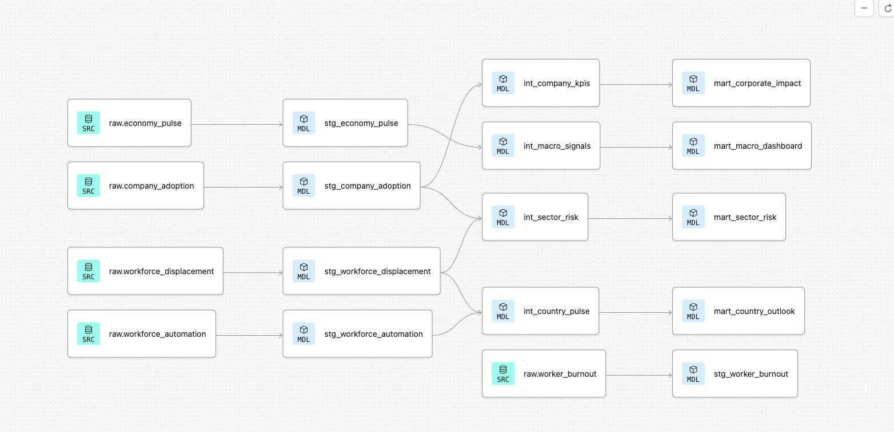

# AI Economy & Labor Market Pipeline — dbt × Snowflake

End-to-end dbt project on the Kaggle *Global AI Economy & Labor Market Transformation* dataset.
Five raw sources (~173k rows) transformed through a Medallion architecture into four analytical marts ready for BI consumption.

The goal: take a heterogeneous, multi-grain dataset (daily stock prices, quarterly corporate surveys, annual country aggregates, worker-level self-reports) and turn it into clean, tested, query-ready marts answering macro / corporate / workforce questions in a single semantic layer.

---

## Architecture

```
RAW (5 sources)
  ├── company_adoption          150,000 rows × 43 cols  (company × quarter)
  ├── workforce_displacement     20,800 rows × 23 cols  (country × sector × quarter)
  ├── worker_burnout              1,500 rows × 21 cols  (worker)
  ├── economy_pulse               1,098 rows × 38 cols  (daily time series)
  └── workforce_automation          220 rows × 12 cols  (country × year)

      ↓ STAGING (5 views — column normalization)
      ↓ INTERMEDIATE (4 views — joins, window features, aggregation)
      ↓ MARTS (4 tables — analytical artifacts, BI-ready)
```

13 models, 31 tests, lineage graph below:



docs/images/dbt test.png


---

## Why this design

The dataset spans **four different grains** (daily, quarterly, annual, worker-level) and **five different domains** (corporate adoption, workforce displacement, macroeconomic signals, labor sentiment, country-level policy). A flat ELT would force consumers to deal with grain reconciliation every time they query.

The intermediate layer pre-aggregates and joins to a common analytical grain (mostly `country × year` or `industry × country × year`), so each mart can be consumed directly by a dashboard or BI tool without further joins.

Trade-off: more intermediate logic to maintain, but query-side simplicity for downstream users and far better performance on BI tools that materialize per-query.

---

## Marts

| Mart | Grain | Question it answers |
|---|---|---|
| `mart_corporate_impact` | industry × country × year | What ROI are companies actually getting from AI adoption? |
| `mart_country_outlook` | country × year | Which countries are managing the AI transition best? |
| `mart_macro_dashboard` | daily | What macro signals accompany AI adoption waves? |
| `mart_sector_risk` | sector × country × year | Which sectors are most exposed to automation? |

Each mart includes a tier classification (`01_leader / 02_adopter / 03_explorer / 04_laggard`, `01_critical / 02_high / 03_moderate / 04_low`, etc.) computed via `CASE WHEN` on the underlying composite scores. The tiers are explicitly ordered with numeric prefixes so they sort correctly in any BI tool without extra configuration.

---

## Tests

31 tests at source + mart level:

| Test type | Where | Purpose |
|---|---|---|
| `not_null` | Primary keys, business-critical dimensions | Catch ingest failures |
| `unique` | Primary keys (`response_id`, `record_id`, `employee_id`, `date`) | Catch dedup issues |
| `accepted_values` | Categorical columns (`ai_adoption_stage`, `attrition_risk`, tier columns) | Catch unexpected category drift |
| `dbt_utils.expression_is_true` | Composite scores in marts | Enforce business rules (e.g. `composite_risk_score between 0 and 1`) |

The `accepted_values` test on `ai_adoption_stage` surfaced two undocumented categories during initial development (`partial` and `none` weren't in the dataset README) — a good example of why hard-coding expected category lists in tests catches real-world data drift.

---

## Key transformations

### `int_macro_signals` — feature engineering on time series

Computes 7-day rolling averages, daily returns, and a `volatility_regime` classifier on top of the daily stock + macro time series. Window functions:

```sql
avg(nvda_close) over (order by date rows between 6 preceding and current row) as nvda_7d_avg,
(nvda_close / lag(nvda_close) over (order by date) - 1) * 100 as nvda_daily_return_pct
```

### `int_country_pulse` — grain reconciliation

The annual country aggregates and the quarterly sector breakdowns share the `country` dimension but operate at different grains. A `FULL OUTER JOIN` after aggregating quarterly data to annual ensures no country-year combination is dropped on either side.

### `int_sector_risk` — composite scoring

A weighted score combining three signals from the workforce table, with `LEFT JOIN` to the corporate data because industry names don't always match across the two sources (acknowledged limitation, documented in the model):

```sql
round(
    automation_risk_score * 0.4
    + (1 - avg_pct_new_roles) * 0.3
    + least(total_ai_layoffs / 100.0, 1.0) * 0.3,
    3
) as composite_risk_score
```

---

## Project structure

```
ai-economy-dbt/
├── README.md
├── dbt_project.yml
├── packages.yml
├── .gitignore
├── models/
│   ├── staging/
│   │   ├── _sources.yml
│   │   ├── stg_company_adoption.sql
│   │   ├── stg_economy_pulse.sql
│   │   ├── stg_worker_burnout.sql
│   │   ├── stg_workforce_automation.sql
│   │   └── stg_workforce_displacement.sql
│   ├── intermediate/
│   │   ├── int_company_kpis.sql
│   │   ├── int_country_pulse.sql
│   │   ├── int_macro_signals.sql
│   │   └── int_sector_risk.sql
│   └── marts/
│       ├── _marts.yml
│       ├── mart_corporate_impact.sql
│       ├── mart_country_outlook.sql
│       ├── mart_macro_dashboard.sql
│       └── mart_sector_risk.sql
└── docs/images/
    ├── lineage_graph.png
    └── project_card.png
```

---

## Stack

dbt Cloud (Fusion 2.0) · Snowflake · `dbt_utils` 1.x · 5 raw CSVs loaded via Snowsight UI into `AI_ECONOMY.RAW`.

---

## Run it

1. **Snowflake setup** — create the warehouse, database, and schemas:
   ```sql
   create warehouse if not exists analytics_wh warehouse_size = 'xsmall';
   create database if not exists ai_economy;
   create schema if not exists ai_economy.raw;
   ```
2. **Load the 5 CSVs** into `ai_economy.raw` (Snowsight UI > Load Data, or `COPY INTO` from a stage).
3. **Connect dbt Cloud** to Snowflake with the connection details, set development schema to `dbt_<your_name>`.
4. **Install packages**:
   ```
   dbt deps
   ```
5. **Run the full pipeline**:
   ```
   dbt run
   ```
6. **Run all tests**:
   ```
   dbt test
   ```
7. **Generate the catalog and lineage**:
   ```
   dbt compile --write-catalog
   ```

---

## Notes

- The dataset is partly synthetic (per the Kaggle source description). The pipeline is the deliverable, not the conclusions drawn from the numbers.
- `stg_worker_burnout` is currently a terminal node in the lineage — intentionally exposed but not yet consumed by any intermediate, kept available for future worker-level analyses.
- The industry-name mismatch between `company_adoption` and `workforce_displacement` is handled via `LEFT JOIN` in `int_sector_risk`. A proper fix would be a seed-based industry mapping table — out of scope for the current iteration.

---

**David Merilus** — Data Analyst / Analytics Engineer
[LinkedIn](https://www.linkedin.com/in/david-merilus) · merilusdavid@gmail.com
